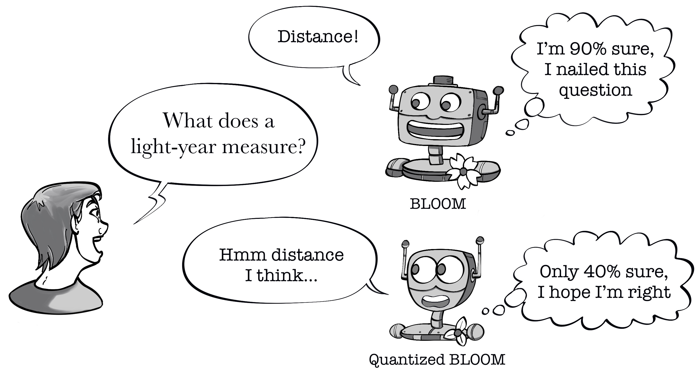

# How quantization affects the confidence of Large Language Models?

This repository contains code for the paper **When Quantization Affects Confidence of Large Language Models?** accepted to NAACL 2024.

<p align="center">

</p>
Recent studies introduced effective compression techniques for Large Language Models (LLMs) via post-training quantization or low-bit weight representation. Although quantized weights offer storage efficiency and allow for faster inference, existing works have indicated that quantization might compromise performance and exacerbate biases in LLMs. This study investigates the confidence and calibration of quantized models, considering factors such as language model type and scale as contributors to quantization loss. Firstly, we reveal that quantization with GPTQ to 4-bit results in a decrease in confidence regarding true labels, with varying impacts observed among different language models. Secondly, we observe fluctuations in the impact on confidence across different scales. Finally, we propose an explanation for quantization loss based on confidence levels, indicating that quantization disproportionately affects samples where the full model exhibited low confidence levels in the first place. We make our code and quantized models publicly available.


## Dependencies

* python 3.10.12
* transformers 4.41.2
* torch 2.3.0
* auto_gptq 0.7.1
* numpy 1.25.2
* datasets 2.19.2

**The quantized models used for the experiments can be found here: https://huggingface.co/iproskurina?search_models=GPTQ** (see models section).

## Usage
<details>
    <summary>Quantization with GPTQ</summary>
       
Use `Quantization_AutoGPTQ.ipynb`. We have used Auto-GPTQ to quantize causalLMs to 4-bits.
    AutoGPTQ documentation: https://pypi.org/project/auto-gptq/ 
</details>

<details>
    <summary>Evaluation</summary>
    
To run an evaluation, use lm-eval-harness framework as shown in ``LLMs_eval.ipynb``.
    Run evaluation on selected [datasets](https://github.com/EleutherAI/lm-evaluation-harness/blob/add-siqa/docs/task_table.md).
    Otherwise, use a recent version of the framework:
```
git clone https://github.com/EleutherAI/lm-evaluation-harness
cd lm-evaluation-harness
pip install -e .
```
Run evaluation:
```
lm_eval\
    --model hf \
    --model_args pretrained="iproskurina/bloom-7b1-gptq-4bit",autogptq="model.safetensors",gptq_use_triton=True \
    --device cuda:0 \
    --tasks hellaswag,piqa,boolq,truthfulqa_mc,arc_easy,xstory_cloze_en,openbookqa \
    --write_out \
    --log_samples\
    --output_path "bloom-7b1-gptq-4bit.json"
```
</details>

<details>
    <summary>Evaluation on TruthfulQA benchmark</summary>
    
To evaluate the informativeness and reliability of generated answers on the TruthfulQA benchmark, refer to the official TruthfulQA [implementation](https://github.com/sylinrl/TruthfulQA). To fine-tune GPT-3 on truthfulQA data, follow the steps listed [here](https://github.com/sylinrl/TruthfulQA?tab=readme-ov-file#fine-tuning-gpt-3-for-evaluation). Note that, starting from January 2024, ```curie``` instance is no longer available. You can use ```davinci-002```instead. Follow [official guidelines](https://platform.openai.com/docs/guides/fine-tuning) to fine-tune the model on truthfulQA data. TruthfulQA predictions (answer generations) for quantized and full-precision models can be found [here](https://drive.google.com/file/d/1Iiepe-gCSgISTWntRAgfS_N1kYcHxYiG/view?usp=sharing).
</details>

<details>
    <summary>Calibration Errors</summary>
    
To compute confidence, calibration errors, and entropy, use `Calibration_Error_Metrics.ipynb`. You can find predictions for full-precision and quantized models [here](https://drive.google.com/file/d/1rlyD832HLa_mqU7JZbA06RhbNwKzpCPS/view?usp=sharing).
</details>

# Cite

```
@inproceedings{proskurina-etal-2024-quantization,
    title = "When Quantization Affects Confidence of Large Language Models?",
    author = "Proskurina, Irina  and
      Brun, Luc  and
      Metzler, Guillaume  and
      Velcin, Julien",
    editor = "Duh, Kevin  and
      Gomez, Helena  and
      Bethard, Steven",
    booktitle = "Findings of the Association for Computational Linguistics: NAACL 2024",
    month = jun,
    year = "2024",
    address = "Mexico City, Mexico",
    publisher = "Association for Computational Linguistics",
    url = "https://aclanthology.org/2024.findings-naacl.124",
    pages = "1918--1928",
    abstract = "Recent studies introduced effective compression techniques for Large Language Models (LLMs) via post-training quantization or low-bit weight representation. Although quantized weights offer storage efficiency and allow for faster inference, existing works have indicated that quantization might compromise performance and exacerbate biases in LLMs.This study investigates the confidence and calibration of quantized models, considering factors such as language model type and scale as contributors to quantization loss.Firstly, we reveal that quantization with GPTQ to 4-bit results in a decrease in confidence regarding true labels, with varying impacts observed among different language models. Secondly, we observe fluctuations in the impact on confidence across different scales. Finally, we propose an explanation for quantization loss based on confidence levels, indicating that quantization disproportionately affects samples where the full model exhibited low confidence levels in the first place.We make our code and quantized models publicly available.",
}
```

```
[When Quantization Affects Confidence of Large Language Models?](https://aclanthology.org/2024.findings-naacl.124) (Proskurina et al., Findings 2024)
```
